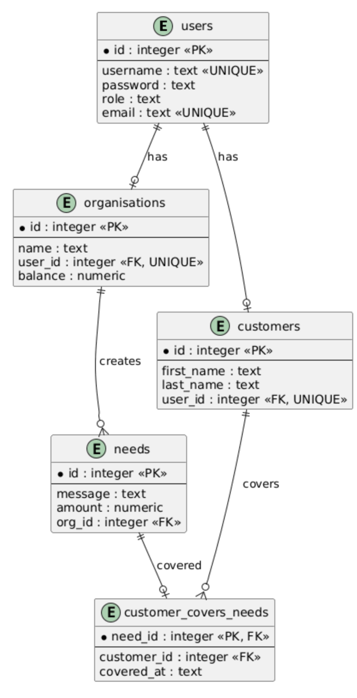

# Design Document

By Dimitrios Mavreas

## Scope

The purpose of this database is to manage a platform that helps animal welfare
organisations support stray animals, such as dogs and cats. Organisations can
create different needs for stray animals, and customers can choose to cover
the full amount of a need.

A need can represent food, medicine, veterinary care or other necessary
supplies for stray animals. Each need has a description and an amount of money
required to cover it. This allows customers to see what an organisation needs
and how much money is required.

The database includes users, animal welfare organisations, customers and
needs. It also stores which customer covered each need and when the need was
covered. In this way, the database can distinguish between covered and
uncovered needs and keep information about the help received by each
organisation.

The database focuses only on storing and managing this information. Actual
payment processing, refunds, communication between users, reviews and
notifications are outside the scope of the database.

## Functional Requirements

A user should be able to:

* Create an account as a customer or an organisation.
* Store information about customers and animal welfare organisations.
* Allow organisations to create needs for stray animals.
* Allow a customer to cover the full amount of a need.
* See which needs have already been covered.
* See which needs are still available to be covered.
* See the needs that belong to each organisation.
* See statistics about the needs of each organisation.
* Keep a record of which customer covered each need.
* Automatically update the balance of an organisation when a need is covered.

The database does not support partial coverage of a need. A need is considered
covered only when one customer covers its full amount. This makes the design
simpler and makes it possible to clearly identify whether a need is covered or
not.

The database also does not process real payments. It only records that a
customer has covered a need. Payment methods, payment verification, refunds,
messages and notifications are not included in the current design.

## Representation

### Entities

The database contains five main tables: `users`, `organisations`, `customers`,
`needs` and `customer_covers_needs`.

#### Users

The `users` table stores the accounts registered on the platform.

* `id` is the unique ID of each user.
* `username` stores the username of the user.
* `password` stores the password.
* `role` shows whether the user is a customer or an organisation.
* `email` stores the email address.

The `id` is stored as an integer and is used as the primary key because every
user needs a unique identifier.

The `username`, `password`, `role` and `email` are stored as text because they
contain textual information. Both `username` and `email` have a `UNIQUE`
constraint because two different accounts should not use the same username or
email address.

The `role` has a `CHECK` constraint that only allows `customer` or
`organisation`. This prevents other values from being inserted and makes it
possible to distinguish between the two types of users.

#### Organisations

The `organisations` table stores information about animal welfare
organisations.

* `id` is the unique ID of the organisation.
* `name` stores the name of the organisation.
* `user_id` connects the organisation with a user account.
* `balance` stores the total amount received by the organisation.

The `id` is the primary key. `user_id` is a foreign key that references
`users.id`. It is also unique because each organisation is connected to one
user account.

The `balance` is stored as a numeric value because it represents an amount of
money. It has a default value of 0 because a new organisation has not received
any money yet. A `CHECK` constraint ensures that the balance cannot be
negative.

#### Customers

The `customers` table stores information about customers who want to help
cover the needs of stray animals.

* `id` is the unique ID of the customer.
* `first_name` stores the customer's first name.
* `last_name` stores the customer's last name.
* `user_id` connects the customer with a user account.

The `id` is an integer and is the primary key of the table. `first_name` and
`last_name` are stored as text.

`user_id` is a foreign key that references `users.id`. It is also unique
because one user account should correspond to only one customer.

#### Needs

The `needs` table stores the needs for stray animals that are created by
organisations.

* `id` is the unique ID of the need.
* `message` describes what is needed, for example food, medicine or veterinary
  care.
* `amount` stores the amount of money required to cover the need.
* `org_id` shows which organisation created the need.

The `id` is an integer and is used as the primary key. The `message` is stored
as text because the organisation needs to provide a description of the need.

The `amount` is stored as a numeric value because it represents money. A
`CHECK` constraint requires the amount to be greater than 0, since a need
cannot have a zero or negative amount.

`org_id` is a foreign key that references `organisations.id`. This ensures
that every need is connected to an existing organisation.

#### Customer Covers Needs

The `customer_covers_needs` table records which customer has covered a need.

* `customer_id` shows which customer covered the need.
* `need_id` shows which need was covered.
* `covered_at` stores the date and time when the need was covered.

`customer_id` is a foreign key that references `customers.id`, while `need_id`
is a foreign key that references `needs.id`.

`need_id` is also the primary key of this table. This was chosen because each
need can only be covered once. A customer can appear in the table many times
and therefore can cover many different needs, but the same `need_id` cannot
appear more than once.

`covered_at` is stored as text and has `CURRENT_TIMESTAMP` as its default
value. This allows the database to automatically record when the need was
covered.

Foreign keys use `ON DELETE CASCADE` where appropriate. For example, if an
organisation is deleted, its needs are also deleted. This avoids leaving
records that refer to an organisation or user that no longer exists.

### Relationships

A user can be associated with a customer or an organisation. The `role`
attribute in `users` indicates which type of account the user has.

One organisation can create many needs, while each need belongs to exactly one
organisation. This creates a one-to-many relationship between `organisations`
and `needs`.

One customer can cover many different needs. However, each need can be covered
by at most one customer. The `customer_covers_needs` table is used to represent
this relationship and also stores the time when the need was covered.

A need does not have to appear in `customer_covers_needs`. If it does not
appear there, it means that the need has not been covered yet.

The entity relationship diagram for the database is shown below:

## Optimizations

Two indexes were created to improve the performance of common queries.

The `needs_org_index` index is created on `needs.org_id`. This column is
frequently used when finding all the needs that belong to a particular
organisation. The index can make these searches faster.

The `covers_customer_index` index is created on
`customer_covers_needs.customer_id`. It is useful when searching for the needs
covered by a particular customer or when calculating information about a
customer's activity.

The database also contains three views to make common queries simpler.

The `uncovered_needs` view shows needs that have not been covered yet. It
combines information from `needs` and `organisations` and checks that the need
does not appear in `customer_covers_needs`.

The `covered_needs` view shows needs that have already been covered. It
combines information about the customer, organisation and need, including the
amount and the time when the need was covered.

The `organisation_statistics` view provides a summary for each organisation.
It shows the total number of needs created by the organisation and how many of
those needs have been covered.

Finally, the database contains a trigger called
`update_organisation_balance`. After a new record is inserted into
`customer_covers_needs`, the trigger finds the amount of the corresponding
need and automatically adds it to the balance of the organisation that created
the need. This avoids having to manually update the balance every time a need
is covered.

## Limitations

One limitation of the database is that a need must be completely covered by
one customer. The current design cannot represent a situation where several
customers contribute smaller amounts towards the same need.

The database also records only that a need has been covered. It does not
represent a real payment transaction and does not store information such as
payment methods, transaction numbers or payment status.

Refunds and cancellations are also not supported. The trigger increases an
organisation's balance when a need is covered, but there is currently no
trigger that decreases the balance if a coverage record is removed.

Another limitation is that individual stray animals are not represented as
separate entities. For example, the database cannot store the name, age,
species or medical history of a particular dog or cat. Information about the
animal can only be included in the message of a need.

Finally, the database does not include more advanced platform features such
as direct communication between customers and organisations, reviews,
notifications or organisation verification. These features could be added in
a future version of the database.
